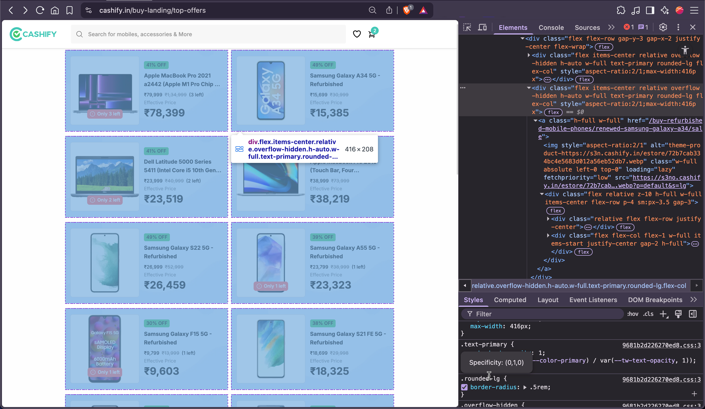

# Cashify Web Scraper

This project contains two web scrapers for extracting product data from [Cashify Top Offers](https://www.cashify.in/buy-landing/top-offers):

- **Node.js & Puppeteer** (in `web-scraper-node/`)
- **Python & BeautifulSoup** (in `web-scraper-python/`)

The scrapers collect product information such as title, price, MRP, discount, product link, and image link.

---

## Example Output

Here is a sample of the extracted data:

```json
[
  {
    "title": "Samsung Galaxy A34 5G - Refurbished",
    "price": "₹15,699",
    "mrp": "₹30,999",
    "discount": "49% OFF",
    "link": "https://www.cashify.in/buy-refurbished-mobile-phones/renewed-samsung-galaxy-a34/sale"
  },
  {
    "title": "Dell Latitude 5000 Series 5411 (Intel Core i5 10th Gen 14 Inch)- Refurbished",
    "price": "₹23,999",
    "mrp": "₹40,999",
    "discount": "41% OFF",
    "link": "https://www.cashify.in/buy-refurbished-laptops/renewed-latitude-5000-series-5411-intel-core-i5-10th-gen-14-inch/sale"
  },
  {
    "title": "Apple MacBook Pro 2019 (Touch Bar, Four Thunderbolt 3 ports) A2141 (Intel Core i7 16 Inch)- Refurbished",
    "price": "₹38,999",
    "mrp": "₹73,999",
    "discount": "47% OFF",
    "link": "https://www.cashify.in/buy-refurbished-laptops/renewed-macbook-pro-2019-touch-bar-four-thunderbolt-3-ports-a2141-intel-core-i7-16-inch/sale"
  }
]
```

---

## Node.js & Puppeteer Usage

1. Install dependencies:
    ```bash
    cd web-scraper-node
    npm install
    ```
2. Run the scraper:
    ```bash
    node scrape
    ```
3. Output will be saved to `web-scraper-node/products.json`.

---

## Python & BeautifulSoup Usage

1. Install dependencies:
    ```bash
    cd web-scraper-python
    pip install -r requirements.txt
    ```
2. Run the scraper:
    ```bash
    python scraper.py
    ```
3. Output will be saved to `web-scraper-python/products.json`.

---

## Screenshots

### Cashify Top Offers Page


### HTML Structure Example

